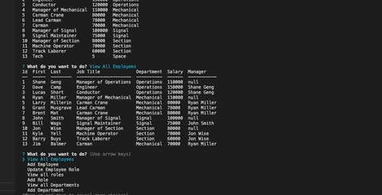

# employee-tracker
A backend employee tracking app 

# Description
This project uses Nodejs, inquirer, and mysql2 to Tke in infomation and store it in a database.

# Completed Task
- Created schema.sql file that creates the database and all the tables
- Used inquirer as the interface to retrieve data in the database
- Ability to modify the data in the datbase

# Links
[Code Repository](https://github.com/Justin-Brueske/employee-tracker)

[Video](./assets/employeetracker.mp4)

# Usage

